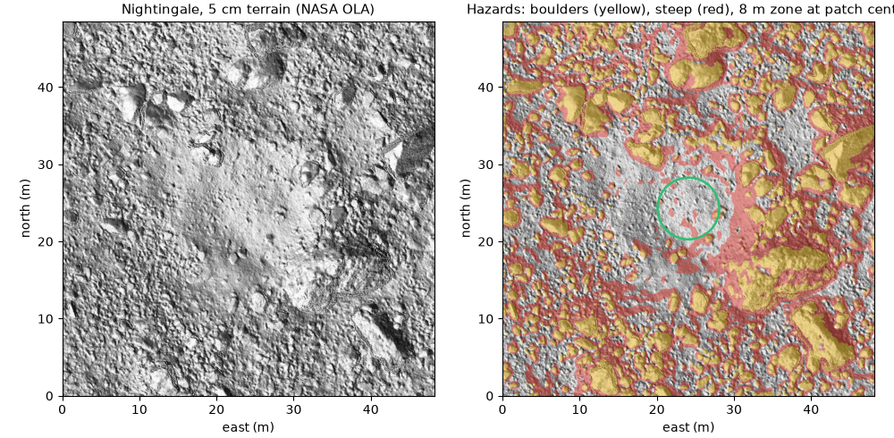
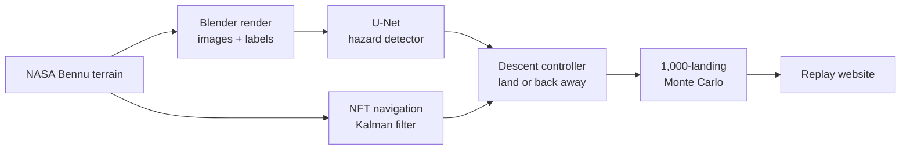
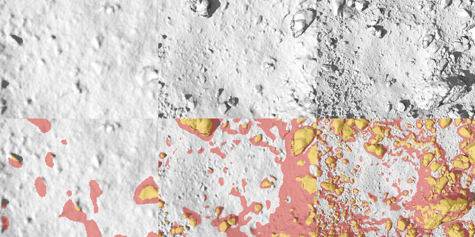
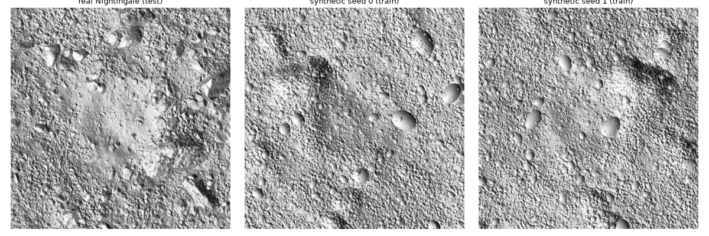
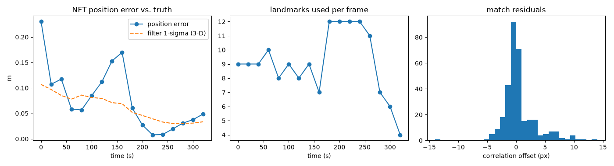

<div align="center">

# TouchDown

**A spacecraft that sees hazards, finds its position without GPS, and lands by itself.**<br>
A from-scratch recreation of the autonomous sample collection NASA's OSIRIS-REx performed at asteroid Bennu.

[](https://github.com/aryanyaksh-art/touch_down/actions/workflows/tests.yml)




<sub>Nightingale, OSIRIS-REx's sample site, from NASA's public 5 cm terrain model. Right: the ground-truth hazards (boulders yellow, steep ground red) and the 8 m sampling zone.</sub>

</div>

## What this is

At Bennu, radio signals take minutes to cross the gap, so the spacecraft has to navigate and decide alone. This project rebuilds that capability end to end: it renders camera images of the real terrain, finds its position from landmarks, flies a ballistic descent, and decides at about 5 m whether to touch down or back away. It then tests the whole system with 1,000 simulated landings and compares the results with published OSIRIS-REx and Bennu data.

It was built as a recreation exercise, so it follows the real mission's method first and adds one clearly labelled extension.

| | Real OSIRIS-REx | TouchDown |
|---|---|---|
| Navigation | Natural Feature Tracking (NFT): match rendered landmarks to camera images, Kalman filter | Same method, reimplemented |
| Descent | Matchpoint burn, ballistic fall, contact at ~10 cm/s | Same |
| Hazard avoidance | Ground-built hazard map; autonomous back-away at ~5 m | Same, as the **baseline** |
| Onboard hazard detection | none | **Extension:** neural network on descent images |

## Where it stands

| Part | State |
|---|---|
| Terrain and hazard map | Done. NASA 5 cm Nightingale model; hazards are rocks of 21 cm or more and slopes above 14° |
| Camera simulator | Done. Blender frames with pixel-exact hazard labels; 4,500 labelled images generated |
| Navigation (NFT + Kalman filter) | Done. Centimetre-level in simulation; the filter is overconfident (documented) |
| Descent controller | Done. Matchpoint-style burn, 10 cm/s ballistic descent, back-away decision at 5 m |
| Hazard detector (extension) | v1 was weak on real terrain (boulder IoU 0.22). **v2** (angular synthetic boulders + real west-half frames) reaches boulder IoU 0.55-0.66 on the held-out east half; in a harder 1,000-landing test it cuts hazard contacts on a stale map from 1.9% to 0.6% but adds ~7 points of needless back-aways ([validation](docs/validation.md)) |
| 1,000-landing Monte Carlo | Running. Provisional (first 69 landings): median delivery error 0.31 m, 94% within 1 m, predicted vs. actual contact 3.2 cm |
| Replay website | Built; replay data publishes after the Monte Carlo finishes |

The provisional numbers sit in the same range as the published single landing (within about 1 m; 3.5 cm predicted vs. actual), but one real landing is not a distribution, so this shows plausibility, not equivalence.

## Honest limitations

- **The v1 detector did not help in flight.** In the provisional Monte Carlo it adds needless back-aways and does not reduce hazard contacts (v2 helps only in a harder test, see validation). The aim point is well clear of hazards, so the experiment may also be too easy. Details in [docs/validation.md](docs/validation.md).
- **Simulated descents start at 45 m, not at the real Checkpoint (125 m).** The 5 cm terrain tile is only 48 m wide. The touchdown decision phase is covered; the upstream dispersions are assumed.
- **Several parameters are assumptions**, not mission values (sampler-head radius, abort threshold, burn errors). Each is marked in the code and docs, and a sensitivity analysis is provided.
- **Low-altitude navigation is optimistic**: the simulated camera and the onboard model share a terrain source.

## Pipeline



<details>
<summary><b>Figures</b></summary>

<br>



<sub>Rendered NavCam-style frames at 10, 25 and 50 m (top) with their labels (bottom). Labels are looked up from the 3D position under each pixel, so they register exactly.</sub>



<sub>Training terrains (centre, right): the real ground with its boulders removed and new power-law boulders injected. The real surface (left) is the test set, so the score measures transfer from synthetic to real boulders.</sub>



<sub>Open-loop navigation test: a 0.1 m/s descent from 40 m to 6 m, starting 0.55 m off. One run; caveats in [docs/references.md](docs/references.md).</sub>

</details>

## Run it

Heavy steps (rendering, training, Monte Carlo) are written for a free Colab or Kaggle GPU. Everything else runs locally.

| Step | Where | |
|---|---|---|
| 1. Render the labelled dataset | Colab GPU | [](https://colab.research.google.com/github/aryanyaksh-art/touch_down/blob/main/notebooks/01_render_dataset.ipynb) |
| 2. Train the hazard detector | Colab GPU | [](https://colab.research.google.com/github/aryanyaksh-art/touch_down/blob/main/notebooks/02_train_unet.ipynb) |
| 3. Run the Monte Carlo | Colab GPU | [](https://colab.research.google.com/github/aryanyaksh-art/touch_down/blob/main/notebooks/03_montecarlo.ipynb) |

Locally:

```bash
uv sync
uv run python scripts/fetch_data.py --global   # NASA models, ~430 MB, saved outside the repo
uv run python scripts/build_dtm.py             # 5 cm height grid of Nightingale
uv run pytest
```

The replay website lives in [`web/`](web/) (Vite + React); see its README.

## Repository map

```
touchdown/     the package
  bennu/         terrain loading, height grid, constants
  terrain/       hazard map, synthetic boulders
  render/        camera model, Blender worker and client, GPU ray caster
  dataset/       labelled-image generator
  vision/        U-Net, training, task-aligned evaluation
  nav/           NFT: landmark templates, correlation, Kalman filter
  gnc/           dynamics, targeting burn, back-away decision
  sim/           closed-loop landing, Monte Carlo
  analysis/      comparison with published data, sensitivity, replay export
configs/       physical constants and thresholds, each with its source
scripts/       data download, figures, demos and benchmarks
notebooks/     the three Colab notebooks
web/           replay website
docs/          method, validation, references, expert-review prep
tests/         pytest suite (runs in CI)
```

## Documentation

| Document | What it covers |
|---|---|
| [docs/method.md](docs/method.md) | What each part does, and where it departs from the real mission |
| [docs/validation.md](docs/validation.md) | How each part is checked, the results so far, known weaknesses and planned fixes |
| [docs/references.md](docs/references.md) | Every published value, with its source and whether it is confirmed |
| [docs/expert_prep.md](docs/expert_prep.md) | Questions a space-robotics reviewer is likely to ask, with honest answers |
| [docs/PLAN.md](docs/PLAN.md) | The original project plan |

## Data and credits

Terrain: NASA OSIRIS-REx Laser Altimeter shape models of Bennu, via the [NASA Scientific Visualization Studio](https://svs.gsfc.nasa.gov/5069). Method after the OSIRIS-REx Natural Feature Tracking papers (Olds et al.) and the mission's public TAG material. Rendering with [Blender](https://www.blender.org/). This is an independent educational recreation, not affiliated with NASA.

## License

[MIT](LICENSE)
