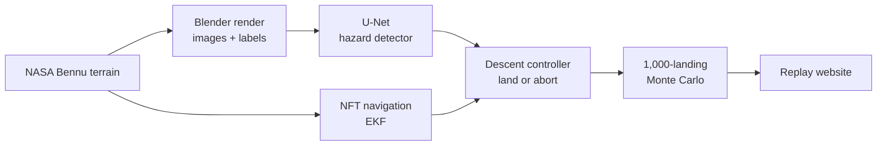

<div align="center">

# TouchDown

**A spacecraft that sees hazards, finds its position without GPS, and lands by itself.**<br>
A from-scratch recreation of the autonomous sample collection NASA's OSIRIS-REx performed at asteroid Bennu.

[](https://github.com/aryanyaksh-art/touch_down/actions/workflows/tests.yml)


<sub>Nightingale, OSIRIS-REx's sample site, from NASA's public 5 cm terrain model. Right: ground-truth hazards used for labels.</sub>

</div>

### Synthetic camera frames and labels


<sub>Top: rendered NavCam-style frames at 10, 25 and 50 m. Bottom: labels (boulders yellow, steep ground red), looked up from the 3D position under each pixel so they register exactly.</sub>

### Train on synthetic, test on real


<sub>Training terrains (centre, right) are the real ground with its boulders removed and new power-law boulders injected. The real Nightingale surface (left) is the test set, so test accuracy measures transfer from synthetic to real boulders.</sub>

## Why

At Bennu, radio signals take minutes to cross the gap, so remote control is impossible. The spacecraft has to navigate and decide alone. This project rebuilds that capability end to end and tests it with 1,000 simulated landings, compared against published OSIRIS-REx and Bennu data.

## Faithful, and what is new

| | Real OSIRIS-REx | TouchDown |
|---|---|---|
| Navigation | Natural Feature Tracking (NFT): match rendered landmarks to camera images, Kalman filter | Same method, reimplemented |
| Hazard avoidance | Ground-built hazard map; autonomous back-away at ~5 m if contact looks unsafe | Same, as the **baseline** |
| Onboard hazard detection | none | **Extension:** neural network on descent images |

## Pipeline



## Status

- [x] Nightingale 5 cm terrain, height grid, ground-truth hazard map
- [x] Blender renderer with pixel-exact hazard labels
- [x] Dataset generator: synthetic training terrains, real Nightingale held out as the test set
- [ ] Render the full dataset on Colab ([notebook](notebooks/01_render_dataset.ipynb))
- [ ] U-Net hazard detector
- [ ] NFT navigation filter
- [ ] Descent controller (Checkpoint, Matchpoint, back-away)
- [ ] 1,000-landing Monte Carlo vs. published data
- [ ] Replay website

## Quick start

```bash
uv sync
uv run python scripts/fetch_data.py --global   # NASA models, ~430 MB, saved outside the repo
uv run python scripts/build_dtm.py
uv run pytest
```

Heavy steps (rendering, training, Monte Carlo) are designed to run on free Colab/Kaggle GPUs.

## Layout

```
touchdown/   bennu, terrain, render, dataset, vision, nav, gnc, sim, analysis
configs/     physical constants and thresholds, each with its source
scripts/     data download, DTM build, figures
tests/       pytest
docs/        plan, references and published values, method notes
```

## Sources

Every constant and comparison value is traced to a paper or NASA release in [docs/references.md](docs/references.md), marked confirmed or to-verify. The full plan is in [docs/PLAN.md](docs/PLAN.md).

## License

MIT
